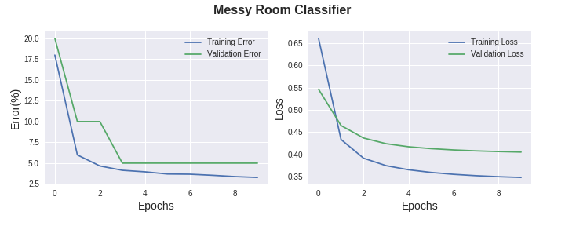
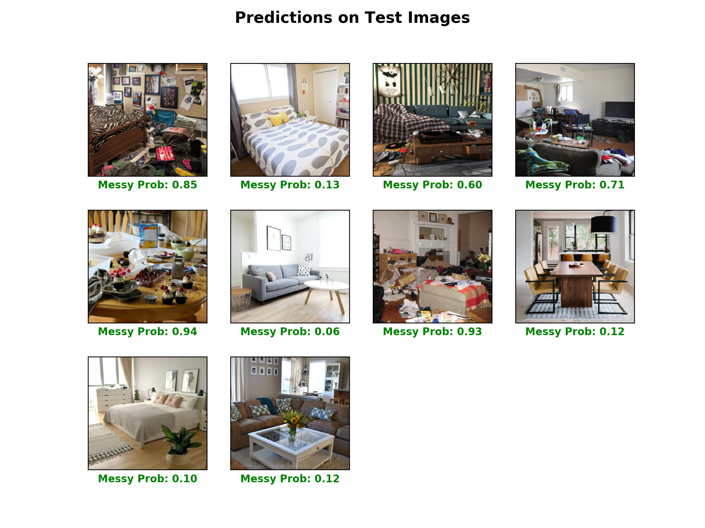

# Messy vs Clean Room Classifier

To try out the idea of [transfer learning](http://cs231n.github.io/transfer-learning/), I decided to work on this scene image
classification project. The objective is to accurately predict if it is messy or clean scene given an image. 

### Dataset
I first built a small dataset consisting of ~200 images. The location is diverse, including bedrooms, living rooms, dining rooms,
study rooms and kitchens, which might help to discourage the model from capturing unrelated features but instead focus more 
on the "messiness". 

All the images are downloaded from Google and preprocessed. The dataset can be found on [Kaggle](https://www.kaggle.com/cdawn1/messy-vs-clean-room). 
There are 192 images in the training set (96 per class); 20 images (10 per class) in the validation set; 10 images (5 per class) in the test set.
The test set is left untouched during the training and tuning, and it is only used in the final step to assess the generalization
of the model.

### Design
In this project, I used the pretrained CNN model [Xception](https://arxiv.org/abs/1610.02357) as the body, 
and build a custom head to decode the feature in the end. Xception is an improvement from Inception-V3. 
It has 79% Top-1 and 94.5% Top-5 accuracy on ImageNet. The pretrained model takes 299x299x3 image input and 
outputs a 2048x1 feature vector after global average pooling. 
Then I added a fully connected layer of 10 units and an output layer with 1 unit for binary classification. 
L2 regularization is used in both layers to prevent overfitting. Retraining is done using Keras with Tensorflow as backend.

### Preprocessing and augmentation
All the images are cropped to square and resized to 299x299 with OpenCV-Python as described in `preprocessing.py`. For convenience, 
the images are saved as numpy arrays in `room_dataset.py`.
Images are then standardized to N(0, 1) on per channel basis. Since the dataset is very small, the training set is augmented, i.e. train images are 
randomly rotated, shifted, sheared, zoomed or flipped to some degree. 

One trick I found particularly useful (for small dataset) is to do the augmentation beforehand and
save the whole augmented data (e.g. for 20 epochs) with its corresponding labels. We can also use the pretrained model
to extract feature vectors from these augmented data (`aug_and_feature_extract.py`). 

In this way, we only need to compute for the two-layer head later on. In other words, we no longer need to do real time augmentation 
and calculate the whole model again and again (forward pass still time-consuming even though the Xception is non-trainable). 
This is useful when we are not sure about the hyper parameters and need to tune the model many times in the beginning.
However, we might end up with limited variability because once we augment the data, we settle on it. For this specific project, it seems
no issues with this approach so far.

### Training and prediction
Following the above procedures, x_train becomes 3840x2048 array and y_train becomes 3840x1 vector after "pre-augmentation and feature
extraction" (192 x 20 = 3840). That means we get 3840 observations to work with rather than just 192. However, every 192 rows in the array is 
actually  just a slight variation from the original images. To avoid the possibility that two or more images with the same origin are
selected in the same batch (e.g. batch size of 32), we do not shuffle the training set when fitting the model. That said, within
each 192 samples, the order is randomized when we do the augmentation.

Adam is used for optimization with a default learning rate of 1e-3. Binary crossentropy is used as the loss function. 
I also used 0.01 as weight decay for L2 regularization. The 2-layer custom head is saved in the model directory.

The training result is shown below. The model fast converges and achieves 96.7%, 95% (19/20) accuracy on training and validation set
respectively.

To evaluate the generalization capacity of the model, I used a test set that the model has never seen during the training and tuning.
As shown below, the model rather accurately predicts the "probability" of being messy room.

### Other approaches
As described in the [Jupyter notebook](try_PCA_LogiReg_SVM.ipynb), I also tried to use simple logistic regression or SVM to deal with
this task (without data augmentation). Since 2048 dimension is way too many considering the size of the data, I used PCA to reduce the
dimension to 18 which retains 95% of variance. From that, I got 86% training accuracy and 80% validation accuracy by logistic regression. 
Linear SVM gives comparable results. 

The PCA with top two principal components (retains 80% variance) shows that the data might not be linearly separable. 
Finally, SVM with polynomial or Gaussian kernel easily overfits the data.

### Summary
In this project, I followed the transfer learning methodology to apply the pretrained model (object classification) to solve a new problem
(scene classification). I successfully trained a classifier that is able to distinguish messy rooms from clean rooms with reasonable accuracy.
The idea might be useful for developing robot cleaner that can do housework when it "sees" the room is messy. (at least in my dream)

One of the limitations is that the messy rooms in the dataset are rather extreme cases. One might never have
such messiness ever. However, it is very hard to find realistic messy room images online, because people usually post something nice to look or 
something extremely awful that they want to complain about. Consequently, the model may perform poorly to distinguish slight messiness
from slight cleanness, although the "probability" of messiness might provide some hints.

For similar reasons, some of the clean rooms in the dataset are also a bit unrealistic, although I tried to exclude those visually 
appealing rooms taken by photographers or designer because the light, color, view point or other factors might mislead the model. 
However, due to the limitation of image sources, some clean rooms are indeed more spacious and pleasant than being clean per se. 